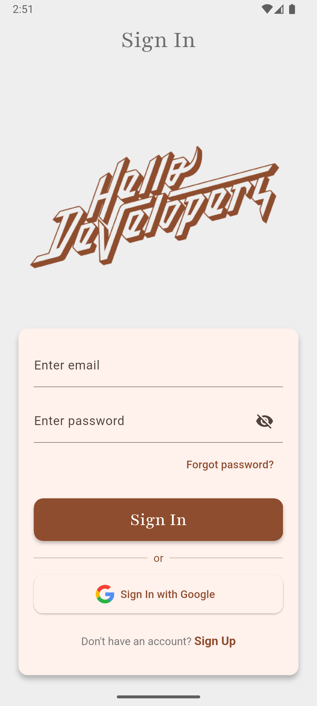
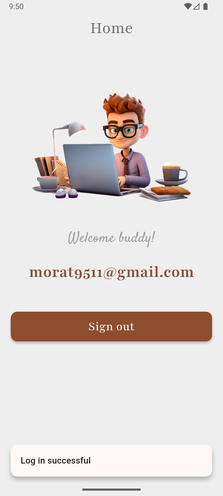
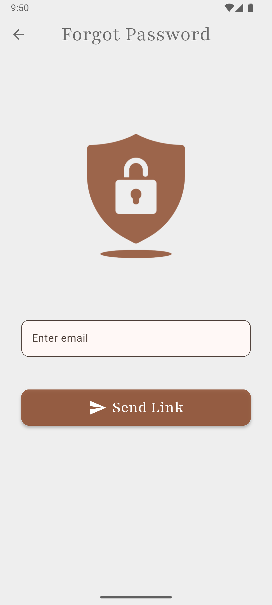
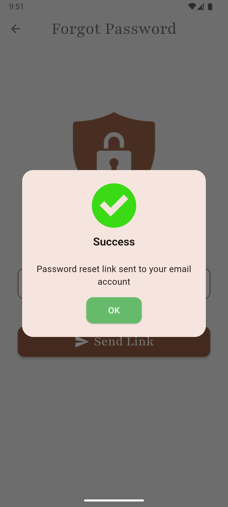
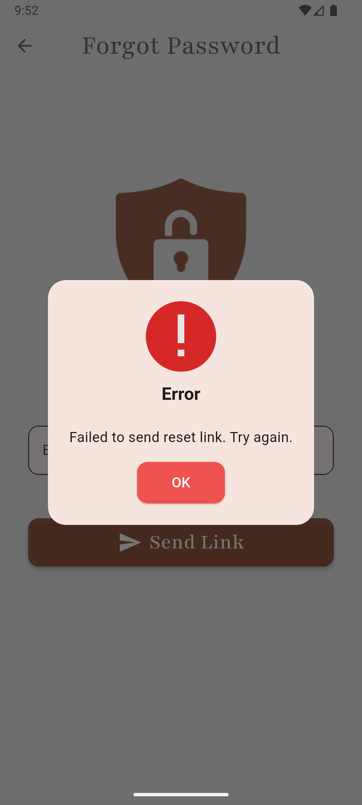

# learn_firebase

A practice Flutter project where I explored **Firebase Authentication**, **Google Sign-In**, **Custom SnackBars**, **Alert Dialogs**, and clean UI building with Riverpod. This project helped me understand real-world auth flow, UI patterns, and reusable components in Flutter.

## 🚀 What I Learned
- Firebase Email/Password Authentication
- Google Sign-In integration
- Custom SnackBars & Alert Dialogs
- Riverpod for state management
- Material 3 UI building with Google Fonts
- Handling loading states safely using `mounted`
- Clean folder structure for scalable apps

## 📦 Tech Stack
- Flutter 3+
- Dart
- Firebase Auth
- Google Sign-In
- Riverpod
- Material Design 3

## 🔥 Features
- Login
- Signup
- Google Sign-In
- Email Verification
- Forgot Password
- Custom Snackbar
- Reusable AlertBox
- Clean UI with proper theming

## 🧪 Project Structure

```bash
lib/
├── features/
│   └── auth/
│       ├── auth_controller.dart
│       ├── repository.dart
│       └── screens/
│           ├── login_screen.dart
│           ├── signup_screen.dart
│           ├── forgot_password.dart
│           └── verify_email.dart
├── widgets/
│   ├── custom_snackbar.dart
│   └── alert_box.dart
└── main.dart
```
## 🖼 UI Screens
<div align="center">
  
  
  
  
  
  
</div>

## 🎯 Purpose

A simple learning project to understand the fundamentals of Firebase Auth + Flutter UI development.

## 💬 Feedback

Open an issue or send a pull request if you want to improve anything.

